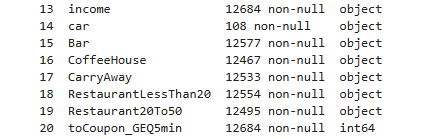

# Berkeley AI + ML Professional Certification Course

## Assignment 5.1 - Will the customer accept the coupon?

In this project, we inspect the data available from [UCI ML Repo] (https://archive.ics.uci.edu/static/public/603/data.csv)

This data contains information regarding coupon acceptance by drivers whose characteristics were known and offered a specific coupon that expires in a short period at a food establishment in the area they were driving in. 

We examine various data characteristics, answer some questions as prompted in the assignment, and then proceed to do our assessment and offer recommendations for **next steps**, including better-targeting coupon users. 

Most of the data analysis is done and explained in the notebook. In this README we explain a few salient points of the study done.

### Data Investigation

Here we describe what we see as problematic or missing data.



1. The _cars_ column has very little data - less than 1%, so we decide to **drop** it, it gives no significant information.
2. All other columns are completely entered - we will see if they have unusable data as we progress.

One confusing category is the _less1_ and _never_ category. At first glance, these seem to mean the same thing, but after some reflection, it could mean that all the counts for Food Habits are possibly counted over time. 

Looking at questions later in this assignment, it becomes clear that the period used here is **month**. So we conclude **never** to mean during the trial, the customer has never visited that type of establishment if that count is denoted as _never_, but we take the _less1_ category to mean that the customer has possibly visited, say a **Coffee House**, at least once but less than a month. Keeping these observations can be helpful when deciding to issue a coupon in the future, such as enticing the customer to try a **new** kind of food establishment they may not have frequented often. 


### Data Cleaning

1. We decide to drop the **cars** column since it contains very few observations.
2. The following columns have NaN values - it makes sense to mark these as `less1` - because it may prove useful in certain cases while deciding to offer coupons.

```
data['Bar'] = data['Bar'].fillna('less1')
data['CoffeeHouse'] = data['CoffeeHouse'].fillna('less1')
data['CarryAway'] = data['CarryAway'].fillna('less1')
data['RestaurantLessThan20'] = data['RestaurantLessThan20'].fillna('less1')
data['Restaurant20To50'] = data['Restaurant20To50'].fillna('less1')
```