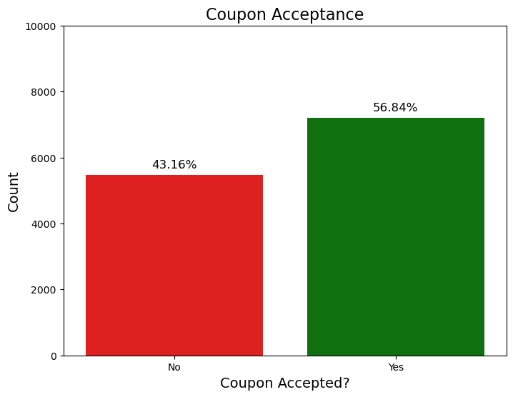
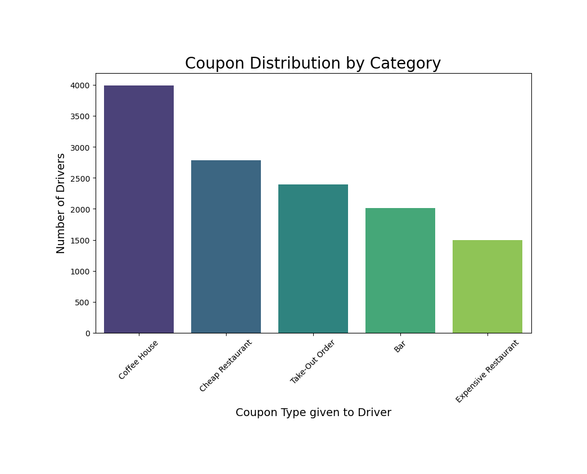
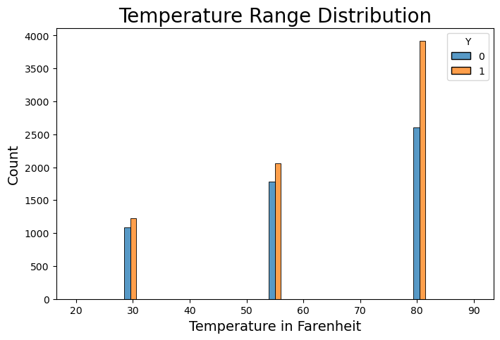

# Berkeley AI + ML Professional Certification Course

## Assignment 5.1 - Will the customer accept the coupon?

In this project, we inspect the data available from [UCI ML Repo] (https://archive.ics.uci.edu/static/public/603/data.csv)

This data contains information regarding coupon acceptance by drivers whose characteristics were known and offered a specific coupon that expires in a short period at a food establishment in the area they were driving in. 

We examine various data characteristics, answer some questions as prompted in the assignment, and then proceed to do our assessment and offer recommendations for **next steps**, including better-targeting coupon users. 

Most of the data analysis is done and explained in the notebook. In this README we explain a few salient points of the study done.

### Data Investigation

Here we describe what we see as problematic or missing data.


1. The _cars_ column has very little data - less than 1%, so we decide to **drop** it, it gives no significant information.
2. All other columns are completely entered - we will see if they have unusable data as we progress.

One confusing category is the _less1_ and _never_ category. At first glance, these seem to mean the same thing, but after some reflection, it could mean that all the counts for Food Habits are possibly counted over time. 

Looking at questions later in this assignment, it becomes clear that the period used here is **month**. So we conclude **never** to mean during the trial, the customer has never visited that type of establishment if that count is denoted as _never_, but we take the _less1_ category to mean that the customer has possibly visited, say a **Coffee House**, at least once but less than a month. Keeping these observations can be helpful when deciding to issue a coupon in the future, such as enticing the customer to try a **new** kind of food establishment they may not have frequented often. 


### Data Cleaning

1. We decide to drop the **cars** column since it contains very few observations.
2. The following columns have NaN values - it makes sense to mark these as `less1` - because it may prove useful in certain cases while deciding to offer coupons.

```
data['Bar'] = data['Bar'].fillna('less1')
data['CoffeeHouse'] = data['CoffeeHouse'].fillna('less1')
data['CarryAway'] = data['CarryAway'].fillna('less1')
data['RestaurantLessThan20'] = data['RestaurantLessThan20'].fillna('less1')
data['Restaurant20To50'] = data['Restaurant20To50'].fillna('less1')
```

### Question 1: 
> What proportion of the total observations chose to accept the coupon?

We look at the column Y that contains the value 1 if accepted or 0 if not accepted. We use the value_counts method on Y and apply the normalize parameter to get the answer in percentage.

```
data.Y.value_counts(normalize=True)
```
More details in the notebook on how the chart was plotted. 


### Question 2:
> Use a bar plot to visualize the coupon column.
We use the value_counts method and obtain the count of each type of coupon issued, and save the data into a new variable - which is a series that has an index for each category and a value that is a count for that category.
```
coupon_data = data.coupon.value_counts()
```
We use the value_counts method and obtain the count of each type of coupon issued, and save the data into a new variable - which is a series that has an index for each category and a value that is a count for that category.


### Question 3:
> Use a histogram to visualize the temperature column.
```
data['temperature'].value_counts()
```
More details in the notebook on how the chart was plotted. 


:memo: **Key Finding** 
Coupon acceptance is greatest at a higher temperature - showing more openness to driving out for food in more comfortable weather conditions.

### Question 4: Bar Coupons

#### 4(a):
> Create a new DataFrame that contains just the bar coupons; and find out What proportion of bar coupons were accepted?

```
bar_coupon_df = data.query('coupon == "Bar"')
bar_coupon_df.Y.value_counts(normalize=True)
```
It is observed that **41.00%** of Bar coupons were accepted.

#### 4(b), (c) & (d) 
> Here we look at various sub-groups and their acceptance rates. 
More details are given and the questions answered in the notebook.

#### 4(e)
> Based on these observations, what do you hypothesize about drivers who accepted the bar coupons?

-  To start with we observe that **41%** of those drivers who were offered Bar coupons accepted them. 
-  We now look at some sub-groups to see what other characteristics of the drivers are significant in the probability that the drivers accepted the Bar coupons.
  -  In Question #4(b) above we see that **76.88%** of those who frequent the bars more than 3 times a month accepted the coupon this is almost **twice** the rate of all the drivers who were offered a Bar coupon.
  -  In Question #4(c)  - we lower the bar - not pun intended 😂 and look at drivers who frequent bars at least once a month and are well above legal age of drinking, i.e. 25 years and above. Here we also find significantly higher rates accepted the coupon at **69.52%**
  -  IMHO, question #4(d) did not give us any extra insight since this group's coupon acceptance at **71.32%** was mostly similar to those we found in Q4. The subgroup of the occupation selected is too small at 0.5% of the total to be of any relavance. The main grouping of selecting those who frequent bars at least once a month is the key discerning factor here.
  -  In Question #6 - we have too many criteria and we seem to be OR'ing them - so the final answer is not in anyway useful in getting us any insight as to who to target in future.

**Summary**
In summary the main point about those who accept Bar coupons are those who frequent the Bars - all those who go to Bars at least once a month were **twice** more than likely to accept the coupon. 

### Independent Investigation

> Using the bar coupon example as motivation, you are to explore one of the other coupon groups and try to determine the characteristics of passengers who accept the coupons.

Among those who have accepted the coupon - let's find out various characteristics of where the chosen restaurant was in terms of driving time and the direction (same or opposite). 
The notebook discusses the analysis and the findings.

The last item we look into is data about coupon acceptance based on age group of the drivers.


### Analysis and Summary of Observation

We noted earlier that in the entire dataset the coupon acceptance is **56.84%** so as a general observation more drivers accepted the coupon than not. 

Here we delver deeper into the drivers age groups to see which group were more succeptible to use the coupon. While many groups tended to mirror the total population, these 2 groups significantly had higher acceptanec rates - **21-25** Year-olds and **26-30** Year-olds. This demographic would be best suited in future promostions to be targetted with coupons. 
